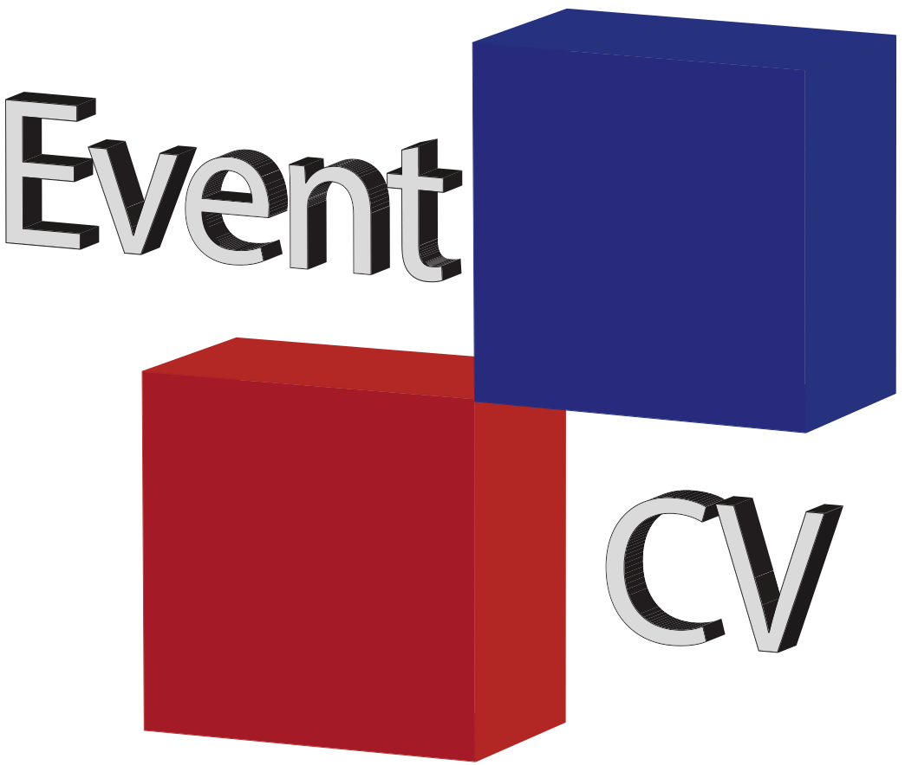

<h1 align="center">

</h1><br>

# EventCV: Open source event-based computer vision library


[](https://pepy.tech/projects/eventcv)
[](
https://anaconda.org/conda-forge/eventcv)

EventCV is "OpenCV" for event-based data and computer vision applications.

## Resources
- **Documentation** - https://eventcv.readthedocs.io
- **Rust core API** - https://docs.rs/eventcv-core

## Installation
```console
# pip
pip install eventcv

# conda
conda install eventcv

# pixi
pixi add eventcv
```

## Contributing
EventCV is an open-sourced project for the event-based computer vision community. We welcome and appreciate contributions from users who would like to propose improvements or feature additions.

Please read the [contribution guidelines](https://github.com/EventLAB-Team/eventcv/blob/main/.github/CONTRIBUTING.md) for more details.